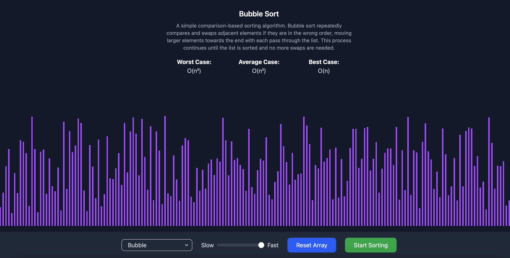
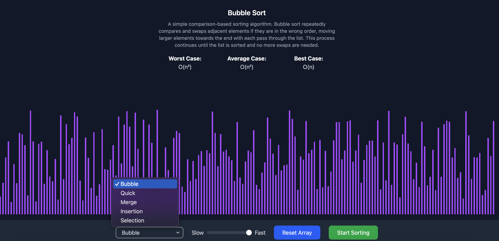

<<<<<<< HEAD

---

```markdown
# 🧠 Algo Visualizer

An interactive algorithm visualizer built with React + Vite.  
Visualize popular sorting algorithms in action and understand how they work, step-by-step.

🔗 **Live Demo:** _Coming Soon_  
📦 **Repository:** https://github.com/satyamkr203/algo-visualizer

---

## 🚀 Features

- 📊 Visual animations of sorting algorithms
- 🎛 Adjustable array size and sorting speed
- 🎯 Multiple algorithms to choose from
  - Bubble Sort
  - Insertion Sort
  - Merge Sort
  - Quick Sort
  - Selection Sort
- 🌗 Light and smooth UI using modern frontend tools

---

## 🛠 Tech Stack

- **Frontend:** React, Vite
- **Styling:** Tailwind CSS
- **State Management:** React Context API
- **Utilities:** ESLint, Prettier

---

## 📸 Screenshots

### 📍 Home Screen


### 📍 Selecting Algorithm


---

## 📦 Setup Instructions

```bash
# Clone the repo
git clone https://github.com/satyamkr203/algo-visualizer
cd algo-visualizer

# Install dependencies
npm install

# Start development server
npm run dev
```

Visit [http://localhost:5173](http://localhost:5173) in your browser.

---

## 📁 Project Structure

```
src/
├── algorithms/          # All sorting algorithm logic
├── assets/              # Images and icons
├── components/          # Reusable UI components
│   └── input/           # UI controls like slider and dropdown
├── context/             # React Context for global state
├── lib/                 # Utility functions
├── App.jsx              # Root component
├── main.jsx             # Entry point
```

---

## 🤝 Contributing

Contributions are welcome!  
Feel free to fork the repo and submit a PR for features, bug fixes, or improvements.

---

## 📜 License

This project is licensed under the [MIT License](LICENSE).

---
=======
# algo-visualizer
Learn sorting the visual way.
>>>>>>> 6326b20 (Initial commit)
